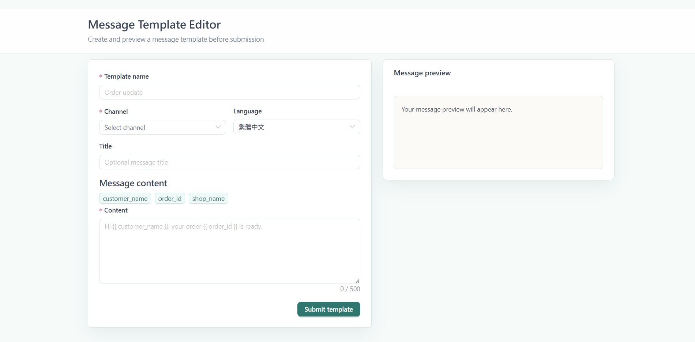
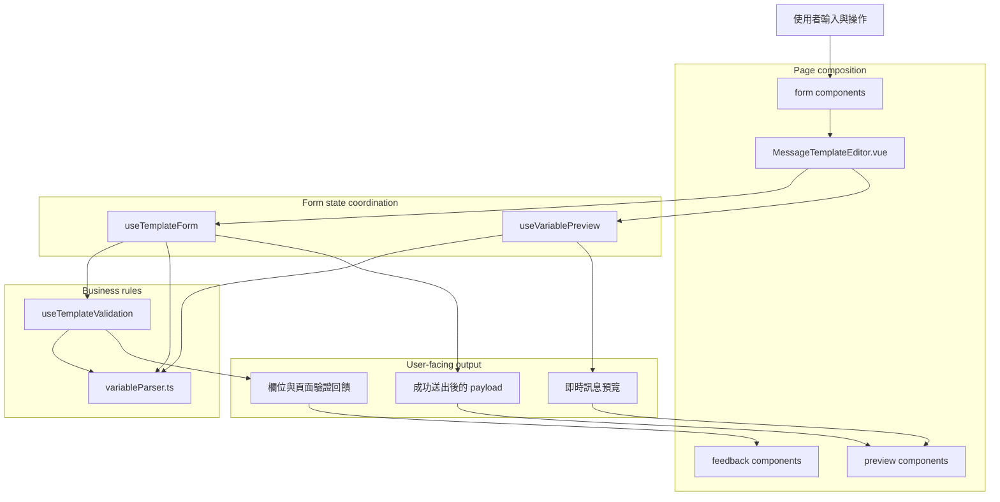

# Vue 3 Message Template Editor


這是一個 Senior Frontend Engineer 面試作業專案。

本專案實作一個可維護的訊息範本編輯器，包含即時預覽、結構化驗證、變數解析，以及送出後產生的 payload。實作方向以可讀性、可維護性與清楚的產品行為為優先，而不是追求大量功能。

## 首頁截圖



## 使用技術

- Vue 3，使用 Composition API 與 `<script setup>`
- TypeScript
- Vite
- Vue Router
- Ant Design Vue
- pnpm
- ESLint
- Prettier
- Vitest

## 功能說明

- 建立訊息範本，欄位包含範本名稱、渠道、語言、選填標題與訊息內容。
- 透過變數工具列將支援的變數插入內容編輯器。
- 使用 mock 變數值即時預覽訊息內容。
- 驗證必填欄位、內容長度、渠道限制、未知變數與錯誤的變數語法。
- 僅在成功送出後產生正規化的 JSON payload。
- 預覽會保留未知或格式錯誤的變數，避免編輯中的內容被隱藏或破壞。

支援變數：

| 變數                  | Payload key    | 預覽值           |
| --------------------- | -------------- | ---------------- |
| `{{ customer_name }}` | `customerName` | `Alex`           |
| `{{ order_id }}`      | `orderId`      | `A1024`          |
| `{{ shop_name }}`     | `shopName`     | `Crystal Studio` |

## 畫面相關說明

- 桌面版採用雙欄版面：左側為編輯區，右側為即時預覽與 payload。
- 行動版收斂為單欄版面。
- Header 為 sticky，僅放置頁面層級資訊。
- 欄位層級驗證會在使用者互動後顯示。
- 頁面層級驗證提示只會在送出後顯示。
- 即時預覽會隨輸入內容更新。
- Payload JSON 與即時預覽刻意分離，只在有效送出後顯示。

## 技術需求

- Node.js 24
- pnpm 10.x
- 需要支援原生 ES module 的現代瀏覽器。

## 安裝和運行說明

安裝依賴：

```sh
pnpm install
```

啟動開發伺服器：

```sh
pnpm dev
```

建立 production build：

```sh
pnpm build
```

執行測試：

```sh
pnpm test
```

執行 lint：

```sh
pnpm lint
```

檢查格式：

```sh
pnpm format:check
```

格式化檔案：

```sh
pnpm format
```

## 專案結構

```txt
src/
  components/
    feedback/       # 頁面層級驗證回饋
    form/           # 表單欄位與變數插入 UI
    layout/         # App 層級版面元件
    preview/        # 即時預覽與送出後 payload 預覽
  composables/      # 表單、驗證與預覽的 reactive 邏輯
  constants/        # 支援變數與範本選項
  router/           # Vue Router 設定
  types/            # 共用 TypeScript 型別
  utils/            # 純 TypeScript parser 與 formatter
  views/            # 頁面層級組合
```

## 架構設計

編輯器依照責任拆分，讓每個模組維持清楚邊界：

- `MessageTemplateEditor.vue` 負責組合頁面、處理送出後的頁面層級回饋，並維持編輯區與預覽區的整體配置。
- `useTemplateForm` 負責本地 reactive 狀態、touched fields、驗證錯誤、變數插入與送出後 payload。
- `useTemplateValidation` 集中管理商業驗證規則，並回傳結構化驗證結果。
- `variableParser.ts` 是純 TypeScript utility，負責變數擷取、正規化、替換與語法檢查。
- 展示型元件接收狀態並 emit 使用者意圖，不直接承擔商業規則。



雖然目前作業只有一個頁面，專案仍保留 `router/` 結構。原因是訊息範本編輯器在真實 SaaS 後台中通常會是其中一個功能頁面；保留 router 可以讓未來擴充 template list、detail 或 settings 頁面時，不需要重新調整入口架構。

目前範圍內使用 Vue 本地狀態已足夠，因為表單狀態只存在於單一頁面，也沒有跨路由同步需求。若引入全域 store，會增加額外維護成本，對此作業的核心目標幫助有限。若未來加入跨頁草稿、Auto Save、多人協作狀態或 template list 與 editor 共享資料，會重新評估是否導入 Pinia。

`variableParser.ts` 保持純函式，不依賴 Vue 狀態，因此可以獨立測試，也能在 validation、preview 與 payload 建立流程中共用。若未來變數來源改由 API 提供，只需調整資料來源，不需要修改 parser 本身。

## Validation

驗證邏輯集中在 `useTemplateValidation`，回傳包含 `isValid` 與 `ValidationError[]` 的 `ValidationResult`。

目前驗證規則：

- `templateName` 為必填。
- `channel` 為必填。
- `content` 為必填。
- `content` 不可超過 500 個字元。
- WhatsApp 內容不可包含超過 5 個連續空白。
- 變數語法必須有效。
- 未知變數與格式錯誤的變數語法會分開回報。
- `title` 為選填。
- `language` 目前有預設值，不列入 submit blocking 的必填驗證。

驗證行為：

- Blur validation 會更新欄位內的即時錯誤回饋。
- Submit 會驗證完整範本。
- 無效送出會清除已產生的 payload。
- 有效送出會正規化內容，並建立包含已擷取變數的 payload。

## Variable Parsing

變數格式為 `{{ variable_name }}`。支援的變數名稱使用 snake_case，例如 `{{ customer_name }}`。

Parser 負責：

- 將支援的變數正規化為一致的空白格式。
- 依照首次出現順序擷取支援變數，並去除重複。
- 在即時預覽中以 mock 值替換支援變數。
- 在預覽中保留未知變數。
- 在預覽中保留格式錯誤的 token。
- 將格式錯誤的語法與語法正確但未知的變數分開判斷。

這樣的設計讓預覽更穩定：即使使用者輸入尚未有效，也不會讓 UI 中斷或擅自隱藏原始內容。

## Testing Strategy

測試優先覆蓋商業邏輯，而不是以 snapshot 或視覺細節為主。原因是此作業最容易出錯的地方在 validation、variable parsing、payload 產生與 preview 替換規則，這些邏輯也最適合用單元測試穩定保護。

目前測試範圍：

- `variableParser`：驗證變數正規化、mock 值替換、變數擷取、未知變數判斷與錯誤語法偵測。
- `useTemplateValidation`：驗證必填欄位、內容長度、WhatsApp 連續空白限制、未知變數與錯誤語法的分離。
- `useVariablePreview`：驗證即時預覽會替換支援變數並保留不支援或無效內容。
- `useTemplateForm`：驗證送出流程、payload 產生、invalid submit 清除 payload，以及變數插入後的狀態更新。

目前取捨：

- 沒有加入 end-to-end tests，因為單頁作業的主要風險集中在可獨立測試的邏輯層；若未來加入多頁流程、草稿保存或真實 API，會補上 E2E 測試保護主要使用路徑。
- 沒有針對 Ant Design Vue 元件做大量 DOM 細節測試，避免測試和第三方元件實作綁太緊；目前以 composables 與 utils 保護核心規則。
- 沒有加入 visual regression tests。若未來 UI 需要長期維護、多版面或設計系統整合，會考慮導入 Playwright screenshot 或其他視覺回歸工具。

## 規格解讀

重要解讀與取捨：

- 此作業重視工程判斷，因此實作聚焦在清楚、可測試的核心流程，而不是堆疊功能數量。
- 作業 PDF 本身有一個小矛盾：正式 Validation Rules 只要求 `templateName`、`channel`、`content` 三個欄位必填，但 UX Blueprint 的 Editor Panel 表格將 `language` 也標示為 Required。本實作選擇以正式 Validation Rules 作為 submit blocking 的來源，並提供 `language` 預設值 `zh-TW`，因此使用者不會因為未操作語言欄位而無法送出。
- Payload 被視為送出結果，而不是即時預覽狀態。這比較符合真實表單流程：輸出應代表最近一次成功送出的資料。
- 未知變數屬於驗證錯誤，但預覽仍會保留原始 token，因為靜默移除或替換使用者輸入會造成困惑。
- 格式錯誤的變數語法與未知變數分開處理，讓錯誤訊息更具體，也讓未來擴充支援變數更容易。
- 未引入 Pinia，因為目前單頁流程使用本地狀態與 composables 已足夠，能維持較低複雜度。

## AI 使用

AI 在本專案中作為工程協作助手，協助：

- 拆解需求與辨識規格模糊處。
- 規劃實作範圍並控制變更邊界。
- 檢查 validation 與 variable parsing 的 edge cases。
- 提供以可讀性與可維護性為主的重構建議。
- 協助撰寫文件與整理驗證結果。

最終決策仍以工程判斷為準。AI 的建議會依照作業目標、既有專案慣例與實際行為進行檢查後再採用。

## 未來改善

- 增加 payload 複製到剪貼簿功能。
- 若產品需求擴充，可加入更多渠道專屬驗證規則。
- 若需要多語系介面，可將 UI 文字導入 i18n。
- 增加本地草稿保存，避免編輯中的範本遺失。
